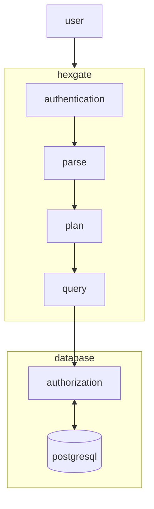

# Hexgate

## Description / Purpose

Hexgate is a REST API wrapper for PostgreSQL, built in Rust. Similar to
PostgREST, it lets you create a RESTful API directly from your PostgreSQL
database schema. This enables easy interaction with your database via HTTP
requests. Hexgate aims to provide a robust, efficient, and secure way to expose
your database operations online.

## Project Architecture

### Flowchart Explanation

1. **User Interaction**:
   - The flow starts with the `user` interacting with the system.

2. **Hexgate Subsystem**:
   - The `user` sends a request to the `hexgate` subsystem.
   - Within `hexgate`, the request goes through several stages:
     - **Authentication**: The system verifies the user's identity.
     - **Parse**: The system parses the request to understand its structure and
       content.
     - **Plan**: The system creates a plan to execute the request.
     - **Query**: The system prepares the query to be sent to the database.

3. **Authorization**:
   - After the query is prepared, it goes through an `authorization` check to
     ensure the user has the necessary permissions to execute the query.

4. **Database Interaction**:
   - The `authorization` process communicates with the `db` (PostgreSQL) to
     execute the query and retrieve the necessary data.

> [!NOTE]\
> All database operations will be run in transaction mode to ensure data
> integrity and consistency. This means that any series of database operations
> will either complete entirely or have no effect at all, providing a reliable
> way to manage database changes.

## Roadmap

## License

Hexgate is licensed under the MIT License. See the [LICENSE](LICENSE.md) file
for more details.
